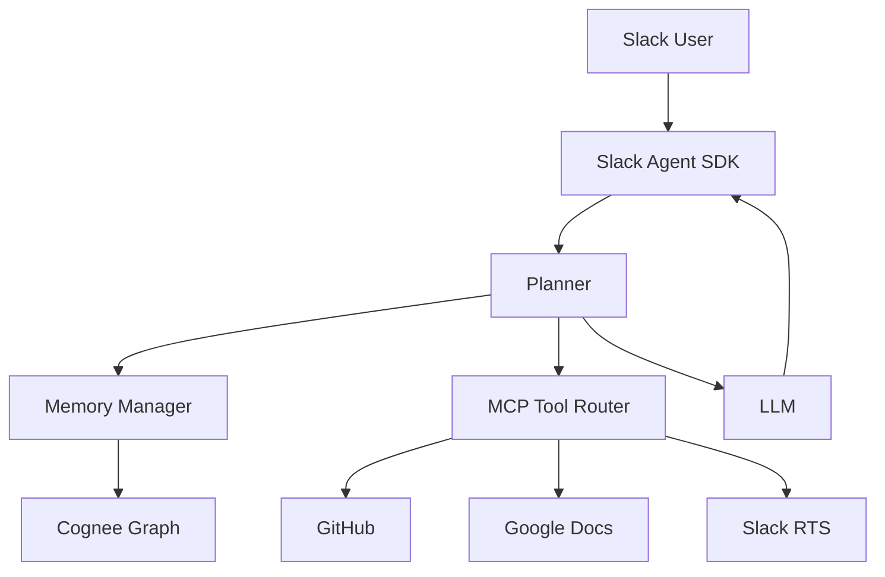
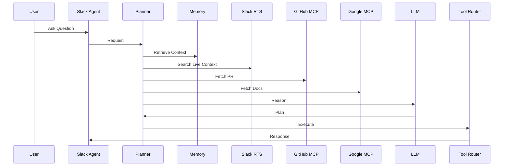
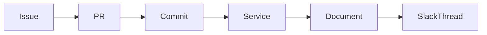

# ARCHITECTURE.md

# Neuron Architecture
### Engineering Memory Graph for Slack

Version: 1.0

Status: Draft

---

# Table of Contents

1. Overview
2. Design Principles
3. High-Level Architecture
4. Core Components
5. System Architecture
6. Agent Runtime
7. Memory Architecture
8. Knowledge Graph
9. Data Flow
10. Ingestion Pipelines
11. MCP Architecture
12. Slack Architecture
13. GitHub Integration
14. Google Docs Integration
15. AI Planning Pipeline
16. Tool Execution
17. Prompting Strategy
18. Storage
19. Background Workers
20. Security Architecture
21. Scalability
22. Deployment
23. Monitoring
24. Future Extensions

---

# Overview

Neuron is designed as an **agent-first**, **event-driven**, **memory-centric**
system.

Unlike traditional Retrieval-Augmented Generation (RAG), Neuron continuously
builds a semantic knowledge graph from engineering artifacts while retrieving
fresh Slack context in real time.

The system consists of five major layers:

- User Interface
- Agent Runtime
- Planning Engine
- Memory Layer
- External Integrations

---

# Design Principles

## Agent First

The AI is not a chatbot.

It is an autonomous reasoning engine capable of:

- Planning
- Tool selection
- Context retrieval
- Multi-step execution
- Reflection

---

## Graph First

Memory is represented as relationships.

Not chunks.

Not embeddings.

Relationships.

---

## Event Driven

Everything generates events.

GitHub webhook

↓

Knowledge Update

↓

Graph Update

↓

Notifications

---

## Source of Truth

| Source | Truth |
|----------|---------|
| GitHub | Code |
| Google Docs | Documentation |
| Slack RTS | Live conversations |
| Cognee | Persistent Memory (GitHub, Docs, derived knowledge) |

---

# High Level Architecture



---

# Core Components

## Slack Agent

Responsibilities

- Slash commands
- Mentions
- Threads
- Agent Home
- Streaming responses
- User authentication

Technology

Slack Agent SDK

---

## Planner

Responsible for:

Intent detection

↓

Task decomposition

↓

Memory retrieval

↓

Tool selection

↓

Execution

↓

Reflection

↓

Response

---

## Memory Manager

Responsible for

Knowledge ingestion

Graph construction

Entity linking

Embedding generation

Relationship extraction

Semantic search

Knowledge extraction from Slack context

---

## Tool Router

Provides unified access to

GitHub

Google Docs

Slack

Future MCP servers

Planner never directly calls APIs.

Planner calls tools.

---

# Agent Runtime



---

# Memory Architecture

Memory consists of three layers.

## Persistent Graph

Stored in Cognee.

GitHub

Docs

Issues

Architecture

PRs

Commits

RFCs

Derived engineering knowledge (decisions, action items, entity relationships)

---

## Derived Knowledge

Knowledge extracted from ephemeral sources and persisted in the graph.

Engineering decisions

Architecture decisions

Action items

Discussion summaries

Meeting outcomes

Entity relationships

Service ownership

Conversation references (lightweight Slack pointers)

Never includes raw Slack content.

---

## Working Memory

Retrieved live per-request.

Slack RTS results

Current thread context

User query context

Temporary tool results

Discarded after response.

---

# Knowledge Graph

Entities

```text
Repository

PullRequest

Issue

Commit

Engineer

Document

Service

Architecture

DiscussionSummary

Decision

ArchitectureDecision

ActionItem

MeetingOutcome

Question

Answer

Risk

Incident

Release

API

ConversationReference
```

Relationships

```text
AUTHORED

REFERENCES

IMPLEMENTS

DEPENDS_ON

DISCUSSED_IN

CREATED_BY

OWNS

MODIFIES

RELATED_TO

SUPERSEDES

DERIVED_FROM

DECIDES

ASSIGNED_TO

AFFECTS

RESOLVES
```

Example



---

# Data Flow

## Installation

```text
Slack Install

↓

OAuth

↓

Connect GitHub

↓

Connect Google

↓

Initialize Workspace

↓

Repository Discovery

↓

Knowledge Extraction

↓

Graph Construction

↓

Ready
```

---

# GitHub Ingestion

Webhooks

Push

Pull Request

Issue

Discussion

Release

Workflow

↓

Parser

↓

Normalizer

↓

Entity Extractor

↓

Relationship Builder

↓

Graph Update

---

# Google Docs Pipeline

Document

↓

Markdown

↓

Chunk

↓

Extract Entities

↓

Extract References

↓

Graph Update

---

# Slack Runtime

Slack messages are NOT ingested continuously.

Raw Slack content is NEVER stored permanently.

Instead, structured engineering knowledge is extracted.

Flow

```
Planner
        │
        ▼
   RTS Search
        │
        ▼
   Thread Expansion
        │
        ▼
   Entity Extraction
        │
   "Who is mentioned?"
   "Which services?"
   "What PRs/issues?"
        │
        ▼
   Decision Extraction
        │
   "What decision was made?"
   "What was the outcome?"
        │
        ▼
   Relationship Resolution
        │
   "How does this connect to existing graph?"
        │
        ▼
   Graph Merge
        │
   "Add Decision node"
   "Link to Service"
   "Link to PR"
   "Add ConversationReference"
        │
        ▼
   Discard Raw Context
        │
        ▼
   Reasoning
```

This follows Slack RTS best practices.

Raw conversations belong in Slack. Knowledge derived from them belongs in the graph.

---

# MCP Architecture

```mermaid
graph TD

Planner

--> MCP Router

MCP Router

--> GitHub MCP

MCP Router

--> Google Docs MCP

MCP Router

--> Slack MCP

MCP Router

--> Future MCP
```

Planner only understands capabilities.

Example

```
Need Issue Creation

↓

Discover Tool

↓

Execute Tool

↓

Receive Result
```

No hardcoded workflows.

---

# AI Planning Pipeline

```text
User Query

↓

Intent Detection

↓

Task Planning

↓

Required Memory

↓

Required Tools

↓

Retrieve Context

↓

Reason

↓

Execute

↓

Validate

↓

Respond
```

---

# Prompt Layers

System Prompt

↓

Workspace Context

↓

Memory Context

↓

Slack Context

↓

Tool Results

↓

User Prompt

↓

Response

---

# Context Retrieval Strategy

Priority

1. User Context

2. Live Slack

3. Memory Graph

4. GitHub

5. Docs

6. Historical Decisions

This minimizes hallucinations.

---

# Tool Execution

Example

User

```
Create issue from today's discussion
```

Planner

↓

RTS

↓

Summarize

↓

GitHub MCP

↓

Create Issue

↓

Return URL

---

# Background Workers

Workers

Repository Sync

Graph Builder

Relationship Extraction

Embedding Generator

Webhook Processor

Document Sync

Health Checker

---

# Storage

## PostgreSQL

Workspace metadata

OAuth

Settings

Installations

---

## Redis

Queue

Cache

Sessions

Streaming

---

## Cognee

Knowledge Graph

Entities

Relationships

Embeddings

Semantic Memory

---

# Deployment

```mermaid
graph TD

Slack

↓

Cloudflare

↓

API Gateway

↓

Node Backend

↓

Planner

↓

Workers

↓

Redis

↓

Postgres

↓

Cognee Cloud
```

---

# Caching

Cache

GitHub metadata

Workspace settings

Recent graph queries

Prompt templates

Never cache raw Slack RTS data.

Cache Slack-derived graph entities (decisions, action items, relationships).

---

# Authentication

Slack OAuth

↓

Workspace Install

↓

Bot Token

↓

User Token

↓

GitHub OAuth

↓

Google OAuth

Tokens encrypted.

---

# Event System

```text
Webhook

↓

Queue

↓

Worker

↓

Parser

↓

Memory Update

↓

Notification
```

---

# Error Handling

Every tool execution returns

Success

Failure

Retryable

Fatal

Planner retries automatically.

---

# Monitoring

Metrics

Request latency

Planning latency

Tool latency

LLM latency

Graph update time

Webhook failures

RTS usage

---

# Scalability

Horizontal

Stateless API

Worker Pools

Redis Queues

Independent MCP Servers

Workspace Isolation

---

# Multi-Tenant Design

Workspace A

↓

Graph A

Workspace B

↓

Graph B

No shared memory.

Strict tenant isolation.

---

# Failure Recovery

GitHub unavailable

↓

Retry

↓

Partial response

↓

Notify user

LLM unavailable

↓

Fallback model

↓

Retry

↓

Graceful degradation

---

# Future Architecture

Phase 2

Multiple repositories

Cross-org reasoning

Architecture drift detection

Meeting intelligence

Dependency analysis

---

Phase 3

Self-updating documentation

Proactive engineering insights

Knowledge decay detection

Autonomous engineering assistant

---

# Folder Structure

```
apps/
    slack-agent/

packages/
    planner/
    memory/
    github/
    google/
    slack/
    prompts/
    graph/
    shared/

workers/
    ingestion/
    graph/
    sync/

infra/
    docker/
    terraform/

docs/

tests/
```

---

# Technology Stack

| Layer | Technology |
|---------|------------|
| Language | TypeScript |
| Runtime | Node.js |
| Slack | Slack Agent SDK |
| AI | Gemini 2.5 Flash |
| Memory | Cognee Cloud |
| Database | PostgreSQL |
| Cache | Redis |
| Queue | BullMQ |
| ORM | Prisma |
| Validation | Zod |
| API | Hono |
| Deployment | Docker |
| Hosting | Railway/Fly.io/AWS |
| Monitoring | OpenTelemetry |

---

# Engineering Philosophy

Neuron is not another chatbot.

It is an Engineering Memory Platform.

Every design decision follows three principles:

- Preserve knowledge
- Explain decisions
- Automate engineering workflows

The goal is not to answer questions faster.

The goal is to ensure engineering knowledge is never lost.